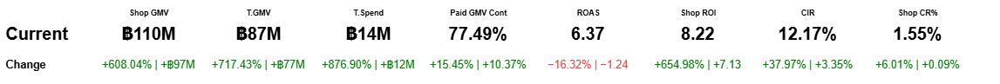

# Vega-Lite Metric Panel (2-row)

A **plug-and-play** Vega‑Lite component for dashboards:  
- **Row 1:** Current value (large, bold)  
- **Row 2:** Change as **`±%.2% | ±K/M/B`** (auto‑formats, color-coded red/green)



---

## Quick start (local preview)

1. Download this folder and open **`index.html`** in your browser.
2. You’ll see the component rendered with dummy data.

> No build step required — it loads Vega/Vega‑Lite from a CDN.

---

## Files

- `index.html` — self-contained preview that renders the panel.
- `metric-panel.vegalite.json` — reusable spec. It expects a named dataset **`dataset`**.
- `sample-data.json` — example data used by the preview (same shape your data should follow).
- `preview.png` — image preview for your repo landing page (optional).

---

## Data shape (required columns)

Each row is one metric card.

| Column             | Type    | Example           | Notes |
|--------------------|---------|-------------------|-------|
| `Metric`           | string  | `Shop GMV`        | Label at the top of each metric |
| `Metric Current`   | number  | `110000000`       | Current (numeric) |
| `Metric Previous`  | number  | `12000000`        | Previous period (numeric) |
| `Order`            | number  | `1`               | Controls left→right order |

---

## Formatting & logic

- **Money metrics** (adds currency sign and `K/M/B` suffix): update the array here in the spec:  
  ```json
  ["Shop GMV","T.GMV","T.Spend"]
  ```

- **Percent metrics** (shown as `%`): update this array:  
  ```json
  ["Shop CR%","Paid GMV Cont","CIR"]
  ```

- **Ratio metrics** (plain numeric with 2 decimals): update:  
  ```json
  ["ROAS","Shop ROI"]
  ```

- **Currency symbol**: change `'฿'` in the spec to your symbol (e.g., `$`, `₹`).

- **Colors**: positive change uses green `#008000`, negative change uses red `#e44`. Modify `ChangeColor` calculation if needed.

---

## How to plug in your own data

Two simple options:

### A) Inline (fastest)
Edit `index.html` and replace the `dummyData` array with your values. Keep columns the same.

### B) External JSON
Keep `index.html` as is and overwrite **`sample-data.json`** with your data.  
The preview will load it automatically.

> If you embed the spec elsewhere, remember the spec refers to a named dataset **`dataset`**. Pass it like:
> ```js
> vegaEmbed(el, spec, { datasets: { dataset: myArray } });
> ```

---

## Attribution & License

- Built with [Vega-Lite v5](https://vega.github.io/vega-lite/).
- MIT License — free to use and modify.  
- Preview image is illustrative dummy data.

Made with ❤️ to speed up dashboard building.
