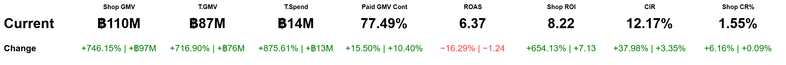

# 📊 Vega-Lite Metric Panel Visualization

A minimalist **metric dashboard built with Vega-Lite**, showing two-row metric cards:
- **Top row:** current value (formatted automatically)
- **Bottom row:** % and absolute change, color-coded red/green



---

## 🧠 How It Works
This visualization uses a Vega-Lite JSON spec (`visualization.vl.json`) rendered through `index.html` with the Vega-Embed library.

- Built on **Vega-Lite v5**
- Data embedded directly in the JSON spec
- Formatting logic for:
  - Money (`฿`, `K/M/B` suffixes)
  - Percent metrics (`%.2%`)
  - Ratio metrics (plain numeric)

---

## 🚀 Try It Yourself

### Option 1 – Online (GitHub Pages)
1. Upload all files (`index.html`, `visualization.vl.json`, and images) to your repo root.
2. Go to **Settings → Pages**.
3. Under “Build and deployment,” choose:
   - **Source:** `Deploy from a branch`
   - **Branch:** `main`
   - **Folder:** `/ (root)`
4. Save — you’ll get a public link like  
   `https://<username>.github.io/<repo>/`

Visit that link and see your dashboard live 🎉

---

### Option 2 – Local
If you’d rather run it locally:

```bash
python3 -m http.server 5500
# Then open http://localhost:5500/index.html
```

---

## 🧩 Files in This Repo

| File | Description |
|------|--------------|
| `index.html` | Main HTML wrapper that loads Vega, Vega-Lite, and the visualization. |
| `visualization.vl.json` | Vega-Lite spec with embedded dataset. |
| `visualization.html` | Alternative standalone version (renders same chart). |
| `visualization.png` / `visualization.svg` | Preview images. |

---

## 🪪 License
MIT License — free to use, modify, and share.
